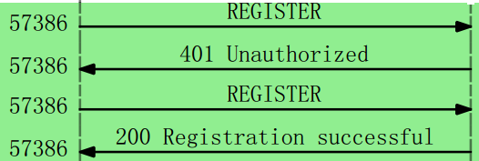

# SIP client in Go

SIP 相关的软件很多 https://en.wikipedia.org/wiki/List_of_SIP_software，可能是实现起来比较简单，很多还是开源的。我没去读源代码，只是看了下pjsip、osip、eXosip 的API，发现pjsip封装的很好，文档也齐全，osip偏底层，用起来十分不方便，所以eXosip就出现了，它不仅封装了osip，还作了扩展，虽然号称提供了 high-level API，用起来还是没pjsip方便，文档也不完善，只有一个 Doxygen 自动生成的文档。不过用别人的东西总是感觉理解不深刻，如果想真正理解就得自己开发一个。

## 结构

目前只实现了 SIP 协议中 REGISTER 过程：

这是软件运行时 Wireshark 抓到的包。

发出的包用 sprintf 生成的，收到的包用正则表达解析，然后按SIP协议的要求反馈。代码很简单，不到200行（包括注释），主要是 golang 的net、regex package 强大。

## 为什么选择 golang？

1. 网络编程十分方便，只要 Dial, Listen, Read Write 就行，比C语言 socket, bind, listen, send, recv ... 方便. 但是 Dial 可以 Dial("tcp") 和 Dial("udp"), Liten却不是Listen("tcp") 和 Listen("udp"), 而是 Listen(叫 ListenTCP 对称一些，也能忍，可以它就是Listen) 和 ListenUDP，看来还是很别扭。
2. golang 有 Google 作靠山。

另外我还写了个 C 语言版的 client：
https://github.com/frams163com/sip_client

go 貌似没有很强大的 SIP 软件，考虑到 go 可以直接调用 C library，做了个exosip封装，还在完善中。。。

做完这个就可以学习媒体部分了。
 
